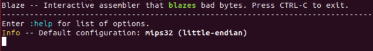
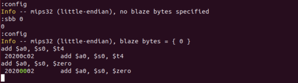
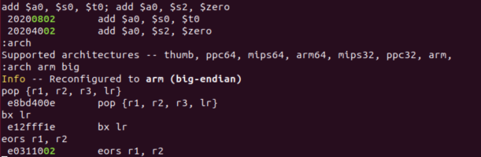
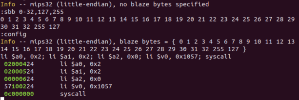

# blaze
Interactive CLI assembler for identifying bad ("blaze") bytes in instruction encodings.

## Dependencies
  * keystone -- ``` pip install keystone-engine```

## Usage
### Startup
* ```python blaze.py``` - configured for mip32 (little) with no blaze bytes set   



### Blaze commands 
Command | Description
------------------|---------------------------------------------------------------
:arch | Displays supported architectures, changes architecture   
:endian | Change endianness
:config | Displays current blaze configuration  
:dbb |Displays blaze byte list (*in decimal*)  
:sbb |Sets the blaze byte list (*in decimal*)   
:rbb |Resets the blaze byte list to None   
:help | Displays list of commands   
:quit | Quits the program (*or use CTRL-C*)   
*instruction* | Instructions to encode and blaze (*; delimited*)
### Supported architectures
  * MIPS, ARM, Thumb, & PowerPC
## Screenshots
##### Configuring blaze to check for NULLs in MIPS32 little endian encodings
  
##### Reconfigure blaze to ARM big endian and highlight blaze bytes   
  
##### Quickly blaze bad bytes in a sequence of instructions (no need to assemble and inspect objdump/hexdump output)  
  
